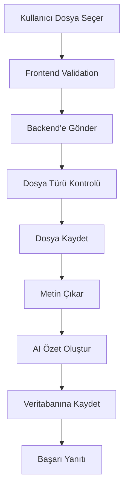
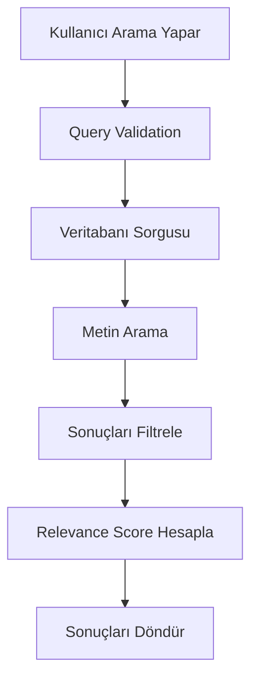

# 📊 Veri Sözlüğü ve Entegrasyon Dokümanı
## Doküman Yönetim Sistemi

---

## 🗂️ Veri Sözlüğü

### Kullanıcı (User) Tablosu

| Alan Adı | Veri Tipi | Uzunluk | Zorunlu | Açıklama |
|----------|-----------|---------|---------|----------|
| id | INTEGER | - | ✅ | Birincil anahtar, otomatik artan |
| email | VARCHAR | 255 | ✅ | Benzersiz e-posta adresi |
| username | VARCHAR | 100 | ✅ | Benzersiz kullanıcı adı |
| hashed_password | VARCHAR | 255 | ✅ | Şifrelenmiş parola |
| full_name | VARCHAR | 200 | ❌ | Tam ad |
| is_active | BOOLEAN | - | ✅ | Hesap aktif mi? (varsayılan: true) |
| is_superuser | BOOLEAN | - | ✅ | Süper kullanıcı mı? (varsayılan: false) |
| created_at | DATETIME | - | ✅ | Oluşturulma tarihi |
| updated_at | DATETIME | - | ❌ | Güncellenme tarihi |

**İlişkiler:**
- `User` → `Document` (1:N) - Bir kullanıcının birden fazla dokümanı olabilir

### Doküman (Document) Tablosu

| Alan Adı | Veri Tipi | Uzunluk | Zorunlu | Açıklama |
|----------|-----------|---------|---------|----------|
| id | INTEGER | - | ✅ | Birincil anahtar, otomatik artan |
| title | VARCHAR | 500 | ✅ | Doküman başlığı |
| filename | VARCHAR | 255 | ✅ | Orijinal dosya adı |
| file_path | VARCHAR | 500 | ✅ | Sunucudaki dosya yolu |
| file_size | INTEGER | - | ✅ | Dosya boyutu (byte) |
| file_type | VARCHAR | 50 | ✅ | Dosya türü (pdf, docx, txt, doc) |
| content | TEXT | - | ❌ | Çıkarılan metin içeriği |
| summary | TEXT | - | ❌ | AI tarafından oluşturulan özet |
| keywords | TEXT | - | ❌ | Anahtar kelimeler (JSON formatında) |
| user_id | INTEGER | - | ✅ | Kullanıcı ID (foreign key) |
| created_at | DATETIME | - | ✅ | Oluşturulma tarihi |
| updated_at | DATETIME | - | ❌ | Güncellenme tarihi |

**İlişkiler:**
- `Document` → `User` (N:1) - Bir doküman bir kullanıcıya ait

---

## 🔗 API Entegrasyonları

### 1. Google Gemini AI API

#### Konfigürasyon
```python
# backend/services/ai_service.py
GEMINI_API_KEY = os.getenv("GEMINI_API_KEY")
GEMINI_BASE_URL = "https://generativelanguage.googleapis.com/v1beta/models"
```

#### Endpoint'ler
- **Model**: `gemini-pro`
- **Maksimum Token**: 30,720
- **Rate Limit**: 15 requests/second

#### Kullanım Senaryoları
1. **Doküman Özetleme**
   ```python
   prompt = f"Bu dokümanı Türkçe olarak özetle: {document_content}"
   ```

2. **Anahtar Kelime Çıkarma**
   ```python
   prompt = f"Bu dokümandan anahtar kelimeleri çıkar: {document_content}"
   ```

#### Hata Yönetimi
```python
try:
    response = gemini_client.generate_content(prompt)
    return response.text
except Exception as e:
    logger.error(f"Gemini API Error: {e}")
    return None
```

### 2. JWT Authentication

#### Token Yapısı
```json
{
  "sub": "user_id",
  "email": "user@example.com",
  "exp": 1640995200,
  "iat": 1640908800
}
```

#### Token Süresi
- **Access Token**: 24 saat
- **Refresh Token**: 7 gün

#### Güvenlik Önlemleri
- Token blacklisting
- Rate limiting
- CORS yapılandırması

---

## 📡 API Endpoint'leri

### Authentication Endpoints

#### POST /api/auth/register
**Kullanıcı Kaydı**
```json
{
  "email": "user@example.com",
  "username": "username",
  "password": "password123",
  "full_name": "Ad Soyad"
}
```

**Yanıt:**
```json
{
  "id": 1,
  "email": "user@example.com",
  "username": "username",
  "full_name": "Ad Soyad",
  "is_active": true,
  "created_at": "2024-01-01T00:00:00Z"
}
```

#### POST /api/auth/login
**Kullanıcı Girişi**
```json
{
  "email": "user@example.com",
  "password": "password123"
}
```

**Yanıt:**
```json
{
  "access_token": "eyJ0eXAiOiJKV1QiLCJhbGciOiJIUzI1NiJ9...",
  "token_type": "bearer",
  "user": {
    "id": 1,
    "email": "user@example.com",
    "username": "username"
  }
}
```

### Document Endpoints

#### POST /api/documents/upload
**Doküman Yükleme**
```multipart/form-data
{
  "file": "document.pdf",
  "title": "Doküman Başlığı"
}
```

**Yanıt:**
```json
{
  "id": 1,
  "title": "Doküman Başlığı",
  "filename": "document.pdf",
  "file_size": 1024000,
  "file_type": "pdf",
  "created_at": "2024-01-01T00:00:00Z"
}
```

#### GET /api/documents/
**Doküman Listesi**
```json
{
  "documents": [
    {
      "id": 1,
      "title": "Doküman Başlığı",
      "filename": "document.pdf",
      "file_size": 1024000,
      "file_type": "pdf",
      "created_at": "2024-01-01T00:00:00Z"
    }
  ],
  "total": 1,
  "page": 1,
  "per_page": 20
}
```

#### GET /api/documents/{document_id}
**Doküman Detayı**
```json
{
  "id": 1,
  "title": "Doküman Başlığı",
  "filename": "document.pdf",
  "file_size": 1024000,
  "file_type": "pdf",
  "content": "Doküman içeriği...",
  "summary": "AI özeti...",
  "keywords": ["anahtar1", "anahtar2"],
  "created_at": "2024-01-01T00:00:00Z"
}
```

### Search Endpoints

#### GET /api/documents/search
**Doküman Arama**
```json
{
  "query": "arama terimi",
  "file_type": "pdf",
  "date_from": "2024-01-01",
  "date_to": "2024-12-31",
  "limit": 20,
  "offset": 0
}
```

**Yanıt:**
```json
{
  "results": [
    {
      "id": 1,
      "title": "Doküman Başlığı",
      "filename": "document.pdf",
      "relevance_score": 0.95
    }
  ],
  "total": 1,
  "query": "arama terimi"
}
```

### Summary Endpoints

#### POST /api/summary/generate
**Özet Oluşturma**
```json
{
  "document_id": 1
}
```

**Yanıt:**
```json
{
  "document_id": 1,
  "summary": "AI tarafından oluşturulan özet...",
  "keywords": ["anahtar1", "anahtar2"],
  "confidence_score": 0.95
}
```

---

## 🔄 Veri Akışı

### Doküman Yükleme Süreci



### Arama Süreci



---

## 🗄️ Veritabanı Şeması

### SQLite Tablo Yapısı

```sql
-- Users tablosu
CREATE TABLE users (
    id INTEGER PRIMARY KEY AUTOINCREMENT,
    email VARCHAR(255) UNIQUE NOT NULL,
    username VARCHAR(100) UNIQUE NOT NULL,
    hashed_password VARCHAR(255) NOT NULL,
    full_name VARCHAR(200),
    is_active BOOLEAN DEFAULT TRUE,
    is_superuser BOOLEAN DEFAULT FALSE,
    created_at DATETIME DEFAULT CURRENT_TIMESTAMP,
    updated_at DATETIME
);

-- Documents tablosu
CREATE TABLE documents (
    id INTEGER PRIMARY KEY AUTOINCREMENT,
    title VARCHAR(500) NOT NULL,
    filename VARCHAR(255) NOT NULL,
    file_path VARCHAR(500) NOT NULL,
    file_size INTEGER NOT NULL,
    file_type VARCHAR(50) NOT NULL,
    content TEXT,
    summary TEXT,
    keywords TEXT,
    user_id INTEGER NOT NULL,
    created_at DATETIME DEFAULT CURRENT_TIMESTAMP,
    updated_at DATETIME,
    FOREIGN KEY (user_id) REFERENCES users(id)
);

-- İndeksler
CREATE INDEX idx_users_email ON users(email);
CREATE INDEX idx_users_username ON users(username);
CREATE INDEX idx_documents_user_id ON documents(user_id);
CREATE INDEX idx_documents_file_type ON documents(file_type);
CREATE INDEX idx_documents_created_at ON documents(created_at);
```

---

## 🔐 Güvenlik Yapılandırması

### CORS Ayarları
```python
ALLOWED_ORIGINS = [
    "http://localhost:3000",
    "http://127.0.0.1:3000",
    "https://yourdomain.com"
]
```

### Dosya Güvenliği
- **İzin Verilen Dosya Türleri**: PDF, DOCX, TXT, DOC
- **Maksimum Dosya Boyutu**: 10MB
- **Dosya Adı Sanitizasyonu**: Güvenli karakterler
- **Virus Tarama**: Planlanan özellik

### API Güvenliği
- **Rate Limiting**: 100 requests/minute
- **Input Validation**: Pydantic modelleri
- **SQL Injection Koruması**: SQLAlchemy ORM
- **XSS Koruması**: Content Security Policy

---

## 📊 Performans Optimizasyonu

### Veritabanı Optimizasyonu
- **İndeksleme**: Sık sorgulanan alanlar
- **Query Optimization**: N+1 problem çözümü
- **Connection Pooling**: SQLAlchemy pool
- **Caching**: Redis (planlanan)

### API Optimizasyonu
- **Pagination**: Sayfalama desteği
- **Async/Await**: Asenkron işlemler
- **Compression**: Gzip sıkıştırma
- **CDN**: Statik dosyalar için

### Frontend Optimizasyonu
- **Lazy Loading**: Component'ler için
- **Code Splitting**: Bundle optimizasyonu
- **Caching**: Browser cache
- **Image Optimization**: WebP formatı

---

## 🔧 Entegrasyon Testleri

### API Test Senaryoları

#### 1. Kullanıcı Kaydı Testi
```python
def test_user_registration():
    response = client.post("/api/auth/register", json={
        "email": "test@example.com",
        "username": "testuser",
        "password": "password123",
        "full_name": "Test User"
    })
    assert response.status_code == 200
    assert response.json()["email"] == "test@example.com"
```

#### 2. Doküman Yükleme Testi
```python
def test_document_upload():
    with open("test_document.pdf", "rb") as f:
        response = client.post(
            "/api/documents/upload",
            files={"file": f},
            data={"title": "Test Document"}
        )
    assert response.status_code == 200
    assert response.json()["title"] == "Test Document"
```

#### 3. Arama Testi
```python
def test_document_search():
    response = client.get("/api/documents/search?query=test")
    assert response.status_code == 200
    assert "results" in response.json()
```

### Entegrasyon Kontrol Listesi

- [x] JWT Authentication çalışıyor
- [x] File upload güvenli
- [x] AI API entegrasyonu aktif
- [x] Database bağlantısı stabil
- [x] CORS yapılandırması doğru
- [ ] Rate limiting aktif
- [ ] Error handling kapsamlı
- [ ] Logging sistemi kurulu

---

## 📈 Monitoring ve Logging

### Log Seviyeleri
- **DEBUG**: Geliştirme detayları
- **INFO**: Genel bilgiler
- **WARNING**: Uyarılar
- **ERROR**: Hatalar
- **CRITICAL**: Kritik hatalar

### Monitoring Metrikleri
- **API Response Time**: < 2 saniye
- **Error Rate**: < %1
- **Uptime**: %99.9
- **Database Performance**: Query süreleri
- **File Upload Success**: %99

### Alert Kuralları
- **High Error Rate**: > %5
- **Slow Response**: > 5 saniye
- **Database Down**: Bağlantı hatası
- **Disk Space**: < %10 kaldı

---

## 🔄 Deployment Süreci

### Development Environment
```bash
# Backend
cd backend
python -m venv venv
source venv/bin/activate  # Windows: venv\Scripts\activate
pip install -r requirements.txt
python main.py

# Frontend
cd frontend
npm install
npm start
```

### Production Environment
```bash
# Docker ile
docker-compose up --build -d

# Manuel deployment
# Backend
gunicorn main:app -w 4 -k uvicorn.workers.UvicornWorker

# Frontend
npm run build
serve -s build
```

### Environment Variables
```env
# Backend
GEMINI_API_KEY=your-api-key
SECRET_KEY=your-secret-key
DATABASE_URL=sqlite:///./document_db.sqlite
ALLOWED_ORIGINS=["http://localhost:3000"]

# Frontend
REACT_APP_API_URL=http://localhost:5000
```

---

*Son Güncelleme: 2024-01-XX*
*Versiyon: 1.0.0*
*Doküman Durumu: Güncel* 